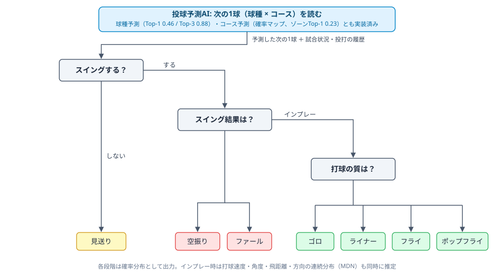
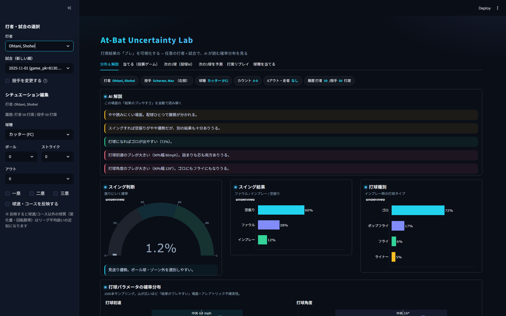
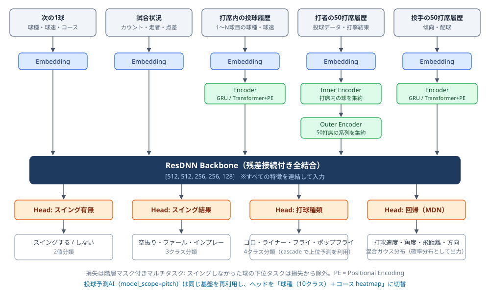

# baseball-realtime-forecast — 研究紹介

**MLB打席内ダイナミクスの階層的予測と、AIの「読み」を観戦体験に変えるリアルタイム予測システムの修士研究**

投手対打者の1球ごとの攻防 ——「次に何を投げるか」「打者は振るか」「振った結果どうなるか」—— を
時系列ディープラーニングで段階的に予測し、その**確率分布と不確実性そのもの**を
「AIと一緒に次の1球を読む」という新しい観戦体験として提示することを目指しています。

> 📌 **このリポジトリについて**
> 本リポジトリは研究内容と成果を紹介するためのものです。
> 研究成果の対外発表前であるため、指導教員の方針により**ソースコード・実験データは非公開**としています。
> 実装・実験・ドキュメントはすべて個人開発で行っています。

---

## 研究概要 — 何をつくっているか

野球の打席では「投げる → 振る → 当てる → 飛ぶ」という事象が連鎖します。
本研究はこの流れを **1つの階層的な予測問題** として定式化し、
2017〜2024年の MLB Statcast データ（1球単位・数百万球規模）で学習した
深層学習モデルにより、次の1球で起きることを確率分布として予測します。

図の構成は [Qiita: 打席結果予測の記事](https://qiita.com/nffrrf0701/items/ab1bd5ad90b8773dbff7) の図を参考に、本研究の構成（投球予測AIの統合・MDN分布出力）を反映して作成し直したものです。

研究は3本柱で構成しています。

1. **打席内ダイナミクスの階層的予測** — スイング有無 → スイング結果 → 打球種類 → 打球パラメータ
   （速度・角度・飛距離・方向）を、階層マスク付きマルチタスク学習で一括予測。
   下位タスクは本質的に確率的なため、点予測ではなく **Mixture Density Network による確率分布**として出力し、
   「予測しきれない揺らぎ＝アレアトリック不確実性」を定量化します。
2. **投球予測AI（次の1球を読む）** — 投手の配球履歴・打席内シーケンス・カウント等から
   「次に何を（球種10クラス）、どこへ（コースの2D確率マップ）投げるか」を予測。
   コースは球種条件付き分布 p(コース|球種) として推定し、球種確率で周辺化する独自構成です。
3. **リアルタイム観戦システム（最終目標）** — MLB Stats API のライブフィードと接続し、
   投球予測AI × 打席予測AIのカスケードで「次の1球で起きること」を根拠付きで毎球表示する
   観戦コンパニオン。予測が当たるかではなく、**観客がAIの読みと一緒に予想して楽しめるか**を評価軸に置きます。

---

## 主な成果・実績

### 1. 予測性能（テストセット・時系列分割）

| タスク | 指標 | 性能 |
|---|---|---|
| スイング有無（2値） | Accuracy | **約 0.93** |
| スイング結果（空振り/ファール/インプレー） | Accuracy | 約 0.54 |
| 打球種類（ゴロ/ライナー/フライ/ポップフライ） | Accuracy | 約 0.48 |
| 次球の球種（10クラス） | Top-1 / Top-3 / ECE | **0.46 / 0.88 / 0.046** |
| 次球のコース（2D確率マップ） | ゾーンTop-1 / Top-3 | **0.228 / 0.502** |
| 球種→打席結果カスケード | 的中率 / ECE | 0.45 / 0.059 |

- 球種予測は「クラス数」で正解率が大きく変わるため生の％比較は不公平ですが、
  同条件（7〜10クラス・全投手・時系列分割）の深層学習研究と比較してトップ級の精度です
  （例: 公開されている seq2seq 研究の 7クラス Top-1 46% に対し、本研究はより難しい 10クラスで Top-1 46%）。
  速球/変化球の2値に換算した場合も既存研究（CMU の打席シミュレーション研究など）とほぼ同水準で、
  スイング判定では **+15pt 上回る**ことを確認しています。
- コース予測は距離・ゾーン一致・NLL のすべてで用意した全ベースラインを上回り、
  ゾーンTop-1 では「真の球種を知っているオラクル基準」さえ超えました。
- スイング結果・打球種類は物理的な揺らぎが支配的な領域で、10版を超える系統的実験により
  **点予測精度の理論的な天井（アレアトリック床）に近い**ことを確認。
  そのため研究の焦点を「精度を上げる」から**「較正された確率分布の品質（NLL / Brier / ECE）と、
  不確実性の観戦価値への変換」**に移した、という設計判断自体が本研究の特色です。

### 2. デモアプリ: At-Bat Uncertainty Lab（Streamlit）

「打席結果のブレ」を可視化するインタラクティブUIを単独で設計・実装しました。

大谷翔平 vs M.シャーザー（カッター・カウント0-0）の実画面。AI解説が「結果のブレやすさ」を自動で読み解き、スイング確率・スイング結果・打球種別・打球パラメータの確率分布を表示する。

- **任意の打者×試合を選択**（756打者）— 直前までの打者/投手履歴を動的に構築して推論（約0.3秒）
- **What-if 探索** — 球種・コース・球速・カウント・走者/アウトを編集すると予測分布が即座に変化
- **確率分布の可視化** — スイング確率ゲージ、確率バー、打球速度・角度・飛距離の MDN 分布、
  打球方向×角度の2Dヒートマップ、球種別コースマップ
- **AI解説モード** — 予測分布のエントロピーと分布幅から「読みにくい場面」を自動コメント
- **投票ゲーム** — 実際の1球について YOU vs AI で予想対決（観戦体験のプロトタイプ）

### 3. モデル・技術面の工夫

図の構成は [Qiita: 打席結果予測の記事](https://qiita.com/nffrrf0701/items/ab1bd5ad90b8773dbff7) の図を参考に、本研究の構成を反映して作成し直したものです。

- **階層マスク付きマルチタスク損失** — スイングしなかった球の下位タスクを損失から除外し、
  因果構造に沿った学習を実現
- **cascade ヘッド** — 上位タスクの予測を下位タスクの入力に接続（投げる→振る→飛ぶの因果を反映）
- **3系統の系列エンコーダ**（GRU / Transformer + Positional Encoding を設定で切替）—
  打席内の投球シーケンス・打者の過去50打席・投手の過去50打席をそれぞれ集約
- **物理境界ソフトラベル** — 打球角度の物理境界±2°を隣接クラスへ確率的に分散し、
  ラベルの曖昧さを学習に反映（ポップフライ検出率 2.5倍を確認）
- **球種条件付きコース密度推定** — p(コース|球種) を球種ごとの確率マップとして学習し、
  推論時に球種確率で周辺化する独自ヘッド
- **確率の較正** — 温度スケーリング等でECE ≈ 0.05 以下を維持し、
  「AIの読み」として提示できる信頼できる確率に

### 4. 研究・開発プロセス（エンジニアリング実績）

- **系統的な実験管理** — 全実験（40件超）を仮説→結果→考察の形で実験ログに記録し、
  モデルレジストリで学習済みモデルと設定を追跡
- **ゴールデン回帰テスト** — 基準モデルの評価指標を固定し、リファクタリングによる
  意図しない挙動変化をコミット単位で自動検出する仕組みを自作
- **単体テスト（pytest 64件）+ CI 的運用** — 変更のたびにテストと回帰チェックを全通し
- **学習の高速化** — bf16 混合精度（AMP)を導入し学習を 1.36倍高速化、
  その過程で発見した dtype 不整合バグも自力で特定・修正
- **従来研究との定量比較・新規性検証** — 関連研究を体系的に調査し、
  評価条件（クラス数・対象投手・分割方法）を揃えた公平な比較と、
  本研究4主張の新規性検証ドキュメントを作成（修士論文の土台）

---

## 新規性 — 既存研究・既存サービスとの違い

体系的な文献・サービス調査の結果、最も近い先行事例は配球「推奨」システム
（プロ野球中継向けの配球予測サービス等）ですが、本研究は以下の点で異なります。

| 観点 | 既存の近傍事例 | 本研究 |
|---|---|---|
| 予測の向き | 捕手への配球「推奨」 | 投手の次球「予測」+ 打者側の応答まで連鎖 |
| 出力 | 球種のみ等の単一出力 | 球種×コース×打席結果の**階層カスケード** |
| 不確実性 | なし | MDN・較正済み確率・エントロピーによる「読みにくさ」の定量化 |
| 目的 | 戦術支援 | **観戦体験**（AIと一緒に読む楽しさ）の創出と評価 |
| 検証 | 商用・非公開 | 時系列分割・ベースライン比較・較正評価による学術的検証 |

---

## 技術スタック

| 分類 | 使用技術 |
|---|---|
| 機械学習 | Python / PyTorch（CUDA・bf16 AMP）/ Mixture Density Network / GRU / Transformer |
| データ処理 | pandas / PyArrow(parquet) / Statcast（pybaseball）による数百万球規模のパイプライン |
| 可視化・デモ | Streamlit / Plotly による対話的な確率分布可視化 |
| 品質保証 | pytest / ruff / 自作ゴールデン回帰テスト / 実験ログ・モデルレジストリ運用 |
| 環境 | Windows 11 / RTX 4070 / conda |

---

## 今後の展望

- **リアルタイム化** — MLB Stats API ライブフィード連携・リプレイモード（2027年シーズンでライブ検証予定）
- **打者傾向特徴のコース予測への投入** — 情報量限界を破る次のレバーとして検証中
- **打席ロールアウト・シミュレータ** — 打席全体の展開を逐次サンプリングし、既存の打席シミュレーション研究と直接比較
- **観戦体験の評価** — 被験者実験による「AIと一緒に予想する」体験価値の検証（修士論文の中核）

---

## クレジット

- マルチタスク学習パイプラインの基盤部分は公開実装
  [carside71/atbat-dynamics-model](https://github.com/carside71/atbat-dynamics-model) を出発点とし、
  投球予測AI・不確実性モデリング・デモUI・検証基盤等を独自に設計・実装しています。
- Statcast データは MLB Advanced Media が提供する公開データを研究目的で利用しています。
- 図2点（フロー図・アーキテクチャ図）は [Qiita 記事](https://qiita.com/nffrrf0701/items/ab1bd5ad90b8773dbff7) の図の構成を参考に自作したものです。
